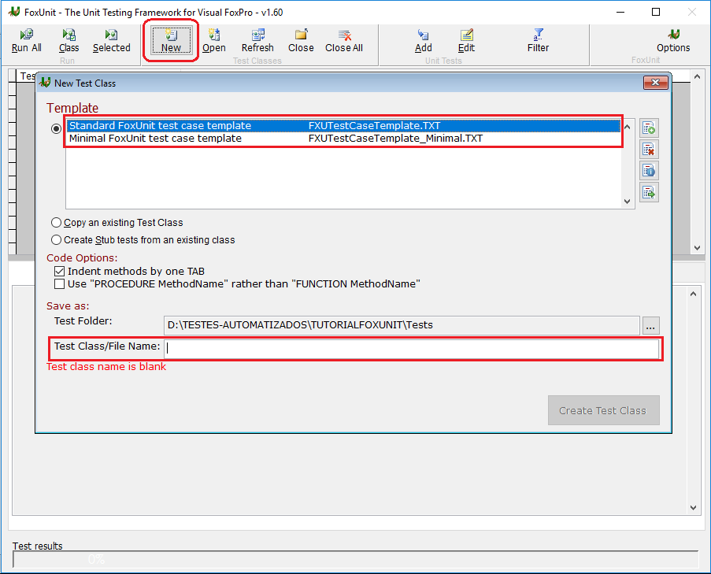
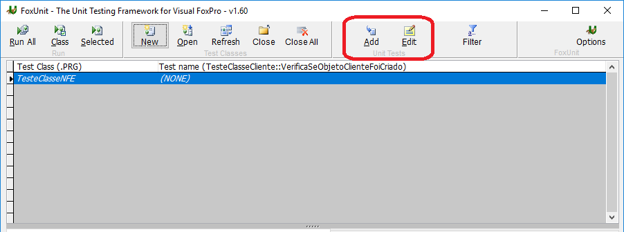

#  Tutorial Básico

## Instalando o FoxUnit

Existe duas formas de instalar o FoxUnit:
* Instalar o "gerenciador de pacotes" [Thor](https://github.com/VFPX/Thor)
* Baixar o arquivo [zip do FoxUnit](https://github.com/VFPX/FoxUnit/blob/master/FoxUnit/FoxUnit.1.6.zip) e extrair na pasta do projeto.

Caso opte pela instalação do Thor, recomendo adicionar o atalho do FoxUnit na barra de ferramentas do VFP.
* OBS.: O VFP deverá ser iniciado utilizando o THOR.APP.

Se optar pelo zip quando executar o arquivo FOXUNIT.APP o mesmo criará uma pasta Tests e iniciára o FoxUnit.

## Criando uma Classe de Teste

Para criar testes unitarios você precisar de uma Classe de Teste referente a qual classe ou formulário você deseja testar.

Para criar uma Classe de Teste no FoxUnit realize os seguintes procedimentos:

* Iniciar o FoxUnit e clique no botão de **New**

    

* Na tela **New Test Class** você deve:
    * Selecionar um template (Recomendo o Standard)
    * Informar nome da Classe de Teste (Ex.: TesteClasseNFE, TesteFrmCadCliente)
    * Clique em **Create Test Class** (O Botão é habilitado após informar o nome da classe e mudar o foco)

* Após criar a Classe de Teste a mesma será apresentada no Grid como na imagem abaixo

    

Você pode editar a Classe realizando um duplo clique sobre a mesma no Grid ou Clicando nos botões de **Add** ou **Edit**.
Quando clicado no botão de Add o FoxUnit cria uma função de teste unitário com um template padrão.

> OBS.: Caso tenha selecionado o template Standard ao criar a Classe de Teste, você terá uma classe com comentários explicativos sobre as funções principais do FoxUnit.

## Funções Principais

* Setup()
Chamado automaticamente no início de cada teste.
Está função deve ser utilizada para instaciar objetos que serão utilizados nas funções de teste unitário.

* TearDown()
Chamado automaticamente no final de cada teste.
Está função serve para efetuar um "Dispose" dos objetos que foram criados na função de Setup().

* Asserts

    * AssertEquals(tuExpectedValue, tuExpression, tcMessage,tuNonCaseSensitiveStringComparison)
    * AssertEqualsArrays(@taArray1, @taArray2, tcMessage)
    * AssertNotEqualsArrays(@taArray1, @taArray2, tcMessage)
    * AssertTrue(tuExpression, tcMessage)
    * AssertFalse(tuExpression, tcMessage)
    * AssertNotEmpty(tuExpression, tcMessage)
    * AssertNotNull(tuExpression, tcMessage)
    * AssertNotNullOrEmpty(tuExpression, tcMessage)
    * AssertIsObject(toObject, tcMessage)
    * AssertIsNotObject(toObject, tcMessage)
    * AssertHasError(tcMessage, toException, taStackInfo)
    * AssertHasErrorNo(tcMessage, toException, tnErrorNo, taStackInfo)
    * AssertNotImplemented(tcMessage)  (The new default return value for new tests)

    O parâmetro **tcMessage** é uma mensagem que será exibida quando o teste falhar, para apresentar uma mensagem quando o teste passar utilize a função **MessageOut(tcMessage)**, a mensagem será apresentada na aba *Messages*

> Para mais informações acesse os links:
>   * https://github.com/VFPX/FoxUnit
>   * https://github.com/VFPX/FoxUnit/blob/master/FoxUnit_Asserts.md
>   * http://www.aksel.com/whitepapers/FoxUnit.htm
        
